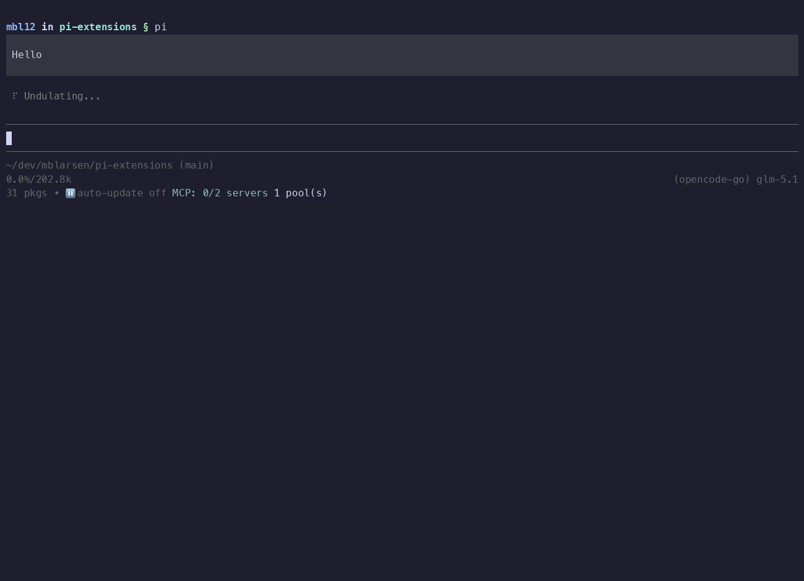

# footer-manager

Manage the Pi status footer — toggle built-in items, reorder extension statuses, and enter a minimal "zen" mode.

## Demo

[](https://asciinema.org/a/yoXyJEt2NjBhK8w2)

## Install

```bash
pi install git:github.com/mblarsen/pi-extensions
```

Filter to just this extension in `~/.pi/agent/settings.json`:

```json
{
  "packages": [
    {
      "source": "git:github.com/mblarsen/pi-extensions",
      "extensions": ["footer-manager/index.ts"]
    }
  ]
}
```

## Usage

| Command | Description |
|---|---|
| `/footer-manager` | Open the interactive footer manager |
| `/footer-manager on` | Enable the managed footer |
| `/footer-manager off` | Disable the managed footer (revert to default) |
| `/footer-manager reset` | Reset layout to defaults |
| `/footer-manager zen` | Toggle zen mode (hide all items) |
| `/footer-manager zen on` | Enable zen mode |
| `/footer-manager zen off` | Disable zen mode |
| `/footer-manager ext <key>` | Toggle visibility of a specific footer item |
| `/footer-manager status-line on` | Show the extension status line |
| `/footer-manager status-line off` | Hide the extension status line |

**Interactive controls** (inside the manager overlay):
- **↑↓** select item · **Space/Enter** toggle visibility · **u/d** reorder extension items · **r** reset · **Esc** close

## What you can control

- **builtin.cwd** — working directory (with git branch)
- **builtin.session** — session name
- **builtin.stats** — token counts, cost, context usage
- **builtin.model** — active model name
- **Extension status items** — any status text registered by other extensions
