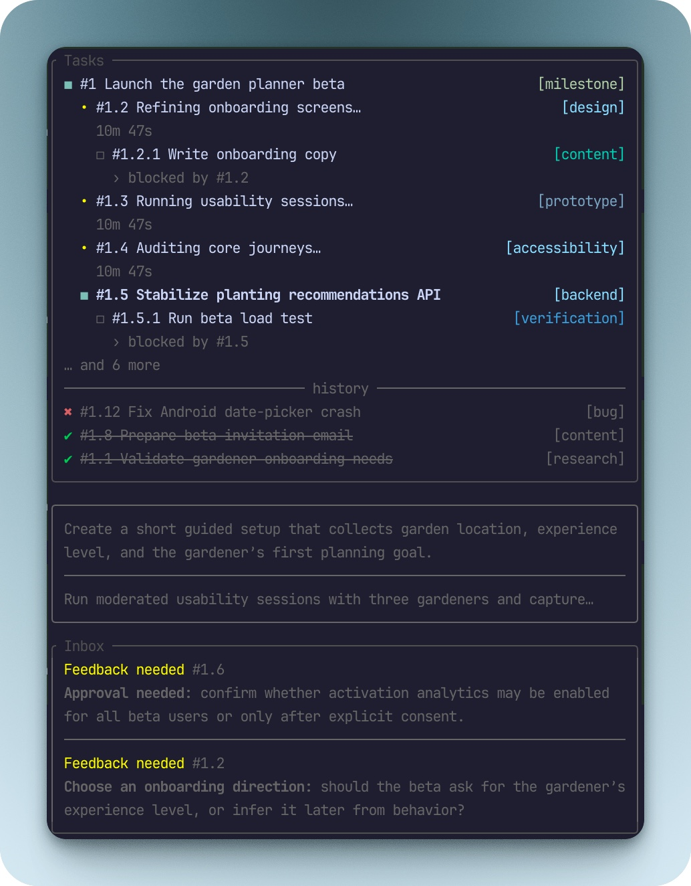

# task-ui

A backend-neutral task sidebar for Pi.



`task-ui` is deliberately presentation-only:

- no planning mode
- no task execution or worker spawning
- no automatic backend calls
- no process control
- no injected system prompts

The agent coordinates a real backend—such as `ctx_task`—and mirrors its state into the UI.

## Install

```bash
pi install npm:@mblarsen/pi-task-ui
```

## UI

The sidebar opens automatically as a non-capturing overlay on the right. Use `Alt+U` (Option+U on macOS), `/task-ui`, or `/task-ui cycle` to cycle sidebar → browse → off → sidebar.

Use a target command to open or hide a view directly:

```text
/task-ui sidebar
/task-ui browse
/task-ui inbox
/task-ui hide
```

You can also open the read-only task browser with `Alt+Shift+U`.

The browser uses most of the terminal. It has `Tasks` and `Inbox` tabs. Press `Tab` to switch between them. `/task-ui inbox` opens the Inbox tab directly.

The Tasks tab shows all projected tasks in stable hierarchy and number order, including terminal history. It starts on the focused task and scrolls through the complete list.

The Inbox tab shows all retained informational entries and unresolved feedback. It puts feedback first and sorts each kind newest-first.

The browser always shows details for the selected item. Task details show the complete task description. Inbox details render the complete stored Markdown summary.

Use `↑`/`↓` or `j`/`k` to move through items. Use `Ctrl-U`/`Ctrl-D` to move by half a viewport. Use `gg`/`gG` to jump to the first or last item. Use `Shift+↑`/`Shift+↓` or `J`/`K` to scroll the selected item's details.

Press `Esc` or `q` to return to the sidebar. Press `Alt+U` in browse mode to hide both views. Browse mode does not change the task projection.

The bar hides responsively below 72 terminal columns. Its `Tasks` panel shows numbered work, nested subtasks, blockers, terminal history, optional right-aligned labels, and projected execution telemetry without a summary or progress bar. Subtasks use stable hierarchical labels such as `#2.1` and `#2.1.1` and render immediately beneath their parent in subtask order. Active and pending work share one stable list capped at the first seven items, so the earliest work retains priority; overflow is summarized as `… and N more`. `history` shows the latest three terminal transitions newest-first and does not reorder them after metadata or output edits. When only history remains, a muted `All done!` message appears above it.

A separate untitled box below the `Tasks` panel shows descriptions for executing `in_progress` tasks. It skips tasks without descriptions, selects at most three tasks in depth-first display order, and shows at most three lines for each description. The box, text, and dividers use dim theme colors. The box hides when no description qualifies or when the terminal cannot show it without clipping the main panel.

The `Inbox` panel appears below task descriptions. It can appear when the task list is empty. It shows at most three stacked entries with fixed `Feedback needed` or `Info` labels. Each entry can show a linked task number and two Markdown preview lines. An overflow count covers entries that do not fit.

The sidebar reserves space in this order: feedback entries, active task descriptions, then informational entries. The visual order remains task descriptions before the Inbox.

| Icon | Meaning |
|---|---|
| `✔` | Completed; dimmed and struck through |
| `◼` | In progress but not currently executing |
| `◻` | Pending |
| `✳` / `✽` | Executing; animated with active-form text, elapsed time, and token counts |
| `✖` | Failed and retained in history |
| `■` | Stopped and retained in history |

`executing` is transient presentation metadata layered over `in_progress`, so several tasks may execute concurrently.

Tasks may carry one short `label`, such as `grilling` or `research`. Labels render in brackets at the right edge while the task title truncates first. Label colors are selected deterministically from the active theme: the same label is always the same color, while different labels spread across the available palette.

Parents are independently executable. Their status and progress are not derived from subtasks, and terminal parent transitions never modify child state. Hierarchy (`parent_id`) and execution dependencies (`blocked_by`) are separate concepts.

## Presentation tools

| Tool | Behavior |
|---|---|
| `task_ui_create` | Add or mirror one numbered root task or subtask, optionally with a label |
| `task_ui_batch_create` | Atomically add or mirror several tasks, including nested hierarchies |
| `task_ui_list` | List projected tasks by one required workflow scope or exact status |
| `task_ui_to_md` | Write the complete projection to a Markdown file |
| `task_ui_get` | Read one task; without `task_id`, return active, next, and focused tasks |
| `task_ui_update` | Update the label, status, blockers, focus-driving state, progress, and execution telemetry |
| `task_ui_output` | Append, read, or clear projected output |
| `task_ui_inbox` | Add, resolve, list, or clear user-facing Inbox summaries |
| `task_ui_remove` | Remove one projected task and detach its children as root tasks |
| `task_ui_clear` | Clear all projected tasks while preserving Inbox entries |
| `task_ui_stop` | Move a task to stopped history, stop its spinner, and advance focus |

`task_ui_remove`, `task_ui_clear`, and `task_ui_stop` do not modify backend work. The agent must perform matching backend actions separately when needed.

### Listing tasks

`task_ui_list` requires exactly one selector. Use `scope` for workflow-oriented groups:

| Scope | Tasks |
|---|---|
| `all` | Every projected task |
| `open` | `pending` and `in_progress` tasks |
| `ready` | Unblocked `pending` tasks |
| `active` | `in_progress` tasks |
| `history` | `completed`, `failed`, and `stopped` tasks |

Use `status` to retrieve one exact stored state: `pending`, `in_progress`, `completed`, `failed`, or `stopped`. Exact `pending` results include blocked tasks, while `scope: "ready"` excludes them.

```ts
task_ui_list({ scope: "ready" });
task_ui_list({ status: "failed" });
```

Providing both selectors or neither selector is invalid.

### Using the Inbox

`task_ui_inbox` is presentation-only. It never replaces the normal user-facing response. The agent must send the complete response as usual and also call this tool when an Inbox entry applies.

Use `info` for a concise, self-contained takeaway. Use `feedback_needed` for the exact question or decision that needs a user response. Each stored Markdown summary has a 400-character source limit. An optional `task_id` links the entry to a projected task.

```ts
task_ui_inbox({
  operation: "add",
  kind: "info",
  markdown: "The import requires a separate session for each active cursor.",
  task_id: "imports",
});

task_ui_inbox({
  operation: "add",
  kind: "feedback_needed",
  markdown: "Should the export include archived records?",
  task_id: "export",
});
```

Informational entries use a rolling limit of 10. Unresolved feedback does not roll off. The tool accepts at most 20 unresolved feedback entries. It rejects entry 21 and asks the agent to clean obsolete or duplicate entries.

After the user answers, the agent resolves the feedback entry. Resolution removes it immediately.

```ts
task_ui_inbox({ operation: "resolve", entry_id: "inbox-3" });
```

Use `operation: "list"` with an optional `kind` to read entries. Use `operation: "clear"` to remove informational entries only. Clear never removes unresolved feedback.

Each operation returns Inbox counts, `suggestedNextTask`, and `suggestedAction`. Add also returns the entry and evicted informational IDs. List returns entries and its selector. Resolve returns the removed entry and the next feedback entry. Clear returns the removed count.

Do not add routine acknowledgments, internal worker messages, duplicate requests, ordinary progress updates, or terminal completion summaries.

### Exporting Markdown

Call `task_ui_to_md` without parameters to write the complete projection to a unique file in the system temporary directory:

```ts
task_ui_to_md({});
```

Pass `path` to select a location. Relative paths resolve from Pi's current working directory.

```ts
task_ui_to_md({ path: "task-handoff.md" });
```

The extension creates the Markdown. The file contains numbered task headings, descriptions, statuses, and local links to dependencies.

The heading level shows the task hierarchy. The tool includes all task statuses in stable hierarchy and number order.

The export also includes complete Inbox summaries. Each entry includes its ID, kind, creation time, and optional linked task ID.

The tool returns the absolute file path. Parent directories must already exist.

The tool will not replace an existing file by default. After the user confirms replacement, call it again with `overwrite: true`:

```ts
task_ui_to_md({ path: "task-handoff.md", overwrite: true });
```

### Agent-oriented results

Tool results can include two independent forms of guidance:

- `suggestedNextTask` contains the next unblocked pending task when relevant. `null` means that none is ready; omission means that the result does not make a next-task recommendation.
- `suggestedAction` contains a textual example of a sensible later `task_ui_*` call.

Other structured result additions include list selectors and status counts, created IDs, changed fields, newly ready tasks, unresolved blockers, Inbox entries and counts, output counts, detached children, removed counts, and recorded stop reasons.

For example:

```text
Later call task_ui_update({ task_id: "worker-1", status: "completed", executing: false, progress: 100 }) when the work is complete.
```

These fields describe the UI projection only. They do not start, stop, or inspect backend work.

The bundled `task-ui` Agent Skill teaches the agent when to create task sets, mirror backend transitions, maintain execution telemetry, use list scopes and exact statuses, and avoid fabricating state. Invoke it explicitly with `/skill:task-ui` or let Pi load it when the request matches its description.

## Checkpoint reminders

The extension sends a hidden context reminder after these successful tool calls:

- a Bash command that invokes `git commit`
- `link_send`

The reminder runs only when the projection contains an active or pending task. It asks the agent to reconcile task status, progress, and execution state before work continues. It also asks the agent to report task-ui changes in the next natural status update without interrupting the current work.

The extension sends at most one reminder per agent turn. A compound Bash command must succeed as a whole. For example, `git commit && git push` does not trigger a reminder when the push fails.

The reminder is hidden from the transcript, but it remains part of the agent context. Task state remains in TUI-only session entries and does not enter the agent context.

### Execution telemetry

A task `subject` is its short title. The optional `description` adds context that helps users and later agent turns recall the work. Create, batch-create, update, snapshot, and upsert operations accept descriptions without a package-defined character limit.

Create and update operations accept:

- `description`: context that supplements rather than repeats the task subject
- `label`: short category or workflow text rendered right-aligned; pass it without brackets
- `parent_id`: nests a task under an independently executable parent
- `executing`: enables the animated execution state
- `active_form`: present-progress text such as `Acquiring plutonium…`
- `started_at`: ISO timestamp used for elapsed time
- `input_tokens` and `output_tokens`: projected token counts
- `blocked_by`: task IDs displayed as numbered dependencies

### Coordinating with `ctx_task`

A typical flow is:

1. Call `ctx_task { action: "create", ... }`.
2. Call `task_ui_create` with the returned backend task ID.
3. Use `ctx_task` for backend state transitions or messages.
4. Mirror those transitions with `task_ui_update` or `task_ui_output`.
5. To stop real work, cancel it through the backend first, then call `task_ui_stop`.

No coupling to `ctx_task` is built into this extension.

## Backend adapter events

Other Pi extensions can update the projection through `pi.events`:

```ts
pi.events.emit("task-ui:snapshot", {
  tasks: [
    { id: "worker-1", subject: "Review API", label: "research", status: "running" },
    {
      id: "worker-2",
      subject: "Run tests",
      status: "running",
      executing: true,
      activeForm: "Running regression suite…",
      startedAt: new Date().toISOString(),
      inputTokens: 4100,
      outputTokens: 1200,
      parentId: "worker-1",
      blockedBy: ["worker-1"],
    },
  ],
  focusedTaskId: "worker-2",
});

pi.events.emit("task-ui:upsert", {
  id: "worker-2",
  label: "verification",
  status: "completed",
  executing: false,
  progress: 100,
});

pi.events.emit("task-ui:output", {
  taskId: "worker-2",
  text: "Regression suite passed",
});

pi.events.emit("task-ui:focus", { taskId: "worker-2" });
pi.events.emit("task-ui:remove", { taskId: "worker-2" });
```

Accepted external status aliases include `running`, `working`, `done`, `success`, `error`, `cancelled`, and `queued`.

Projection snapshots are stored as TUI-only session entries, so state follows Pi session branches without entering model context. A completely new Pi session begins with an empty projection; the bundled Agent Skill instructs the agent to read any persistent task backend and reconcile confirmed tasks by backend ID when resuming backend-managed work.
