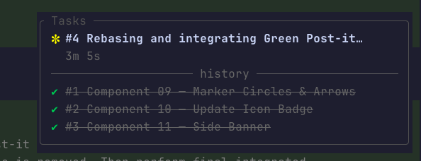

# task-ui

A backend-neutral task sidebar for Pi.



`task-ui` is deliberately presentation-only:

- no planning mode
- no task execution or worker spawning
- no automatic backend calls
- no process control
- no injected system prompts

The agent coordinates a real backend—such as `ctx_task`—and mirrors its state into the UI.

## Install

```bash
pi install npm:@mblarsen/pi-task-ui
```

## UI

The sidebar opens automatically as a non-capturing overlay on the right. Use `Alt+U` (Option+U on macOS), `/task-ui`, or `/task-ui cycle` to cycle sidebar → browse → off → sidebar.

Use a target command to open or hide a view directly:

```text
/task-ui sidebar
/task-ui browse
/task-ui hide
```

You can also open the read-only task browser with `Alt+Shift+U`.

The browser uses most of the terminal and shows all projected tasks in stable hierarchy and number order, including terminal history. It starts on the focused task and scrolls as you move through the complete list. Use `↑`/`↓` or `j`/`k` to move, `Ctrl-U`/`Ctrl-D` to move by half a viewport, `gg`/`gG` to jump to the first or last task, and `Esc` or `q` to return to the sidebar. Press `Alt+U` in browse mode to hide both views. Browse mode does not change the task projection.

The bar hides responsively below 72 terminal columns. Its `Tasks` panel shows numbered work, nested subtasks, blockers, terminal history, optional right-aligned labels, and projected execution telemetry without a summary or progress bar. Subtasks use stable hierarchical labels such as `#2.1` and `#2.1.1` and render immediately beneath their parent in subtask order. Active and pending work share one stable list capped at the first seven items, so the earliest work retains priority; overflow is summarized as `… and N more`. `history` shows the latest three terminal transitions newest-first and does not reorder them after metadata or output edits. When only history remains, a muted `All done!` message appears above it.

| Icon | Meaning |
|---|---|
| `✔` | Completed; dimmed and struck through |
| `◼` | In progress but not currently executing |
| `◻` | Pending |
| `✳` / `✽` | Executing; animated with active-form text, elapsed time, and token counts |
| `✖` | Failed and retained in history |
| `■` | Stopped and retained in history |

`executing` is transient presentation metadata layered over `in_progress`, so several tasks may execute concurrently.

Tasks may carry one short `label`, such as `grilling` or `research`. Labels render in brackets at the right edge while the task title truncates first. Label colors are selected deterministically from the active theme: the same label is always the same color, while different labels spread across the available palette.

Parents are independently executable. Their status and progress are not derived from subtasks, and terminal parent transitions never modify child state. Hierarchy (`parent_id`) and execution dependencies (`blocked_by`) are separate concepts.

## Presentation tools

| Tool | UI-only behavior |
|---|---|
| `task_ui_create` | Add or mirror one numbered root task or subtask, optionally with a label |
| `task_ui_batch_create` | Atomically add or mirror several tasks, including nested hierarchies |
| `task_ui_list` | List projected tasks, optionally filtered by status |
| `task_ui_get` | Read one task; without `task_id`, return active, next, and focused tasks |
| `task_ui_update` | Update the label, status, blockers, focus-driving state, progress, and execution telemetry |
| `task_ui_output` | Append, read, or clear projected output |
| `task_ui_remove` | Remove one projected task and detach its children as root tasks |
| `task_ui_clear` | Clear the entire projection |
| `task_ui_stop` | Move a task to stopped history, stop its spinner, and advance focus |

`task_ui_remove`, `task_ui_clear`, and `task_ui_stop` do not modify backend work. The agent must perform matching backend actions separately when needed.

The bundled `task-ui` Agent Skill teaches the agent when to create task sets, mirror backend transitions, maintain execution telemetry, and avoid fabricating state. Invoke it explicitly with `/skill:task-ui` or let Pi load it when the request matches its description.

## Checkpoint reminders

The extension sends a hidden context reminder after these successful tool calls:

- a Bash command that invokes `git commit`
- `link_send`

The reminder runs only when the projection contains an active or pending task. It asks the agent to reconcile task status, progress, and execution state before work continues. It also asks the agent to report task-ui changes in the next natural status update without interrupting the current work.

The extension sends at most one reminder per agent turn. A compound Bash command must succeed as a whole. For example, `git commit && git push` does not trigger a reminder when the push fails.

The reminder is hidden from the transcript, but it remains part of the agent context. Task state remains in TUI-only session entries and does not enter the agent context.

### Execution telemetry

Create and update operations accept:

- `label`: short category or workflow text rendered right-aligned; pass it without brackets
- `parent_id`: nests a task under an independently executable parent
- `executing`: enables the animated execution state
- `active_form`: present-progress text such as `Acquiring plutonium…`
- `started_at`: ISO timestamp used for elapsed time
- `input_tokens` and `output_tokens`: projected token counts
- `blocked_by`: task IDs displayed as numbered dependencies

### Coordinating with `ctx_task`

A typical flow is:

1. Call `ctx_task { action: "create", ... }`.
2. Call `task_ui_create` with the returned backend task ID.
3. Use `ctx_task` for backend state transitions or messages.
4. Mirror those transitions with `task_ui_update` or `task_ui_output`.
5. To stop real work, cancel it through the backend first, then call `task_ui_stop`.

No coupling to `ctx_task` is built into this extension.

## Backend adapter events

Other Pi extensions can update the projection through `pi.events`:

```ts
pi.events.emit("task-ui:snapshot", {
  tasks: [
    { id: "worker-1", subject: "Review API", label: "research", status: "running" },
    {
      id: "worker-2",
      subject: "Run tests",
      status: "running",
      executing: true,
      activeForm: "Running regression suite…",
      startedAt: new Date().toISOString(),
      inputTokens: 4100,
      outputTokens: 1200,
      parentId: "worker-1",
      blockedBy: ["worker-1"],
    },
  ],
  focusedTaskId: "worker-2",
});

pi.events.emit("task-ui:upsert", {
  id: "worker-2",
  label: "verification",
  status: "completed",
  executing: false,
  progress: 100,
});

pi.events.emit("task-ui:output", {
  taskId: "worker-2",
  text: "Regression suite passed",
});

pi.events.emit("task-ui:focus", { taskId: "worker-2" });
pi.events.emit("task-ui:remove", { taskId: "worker-2" });
```

Accepted external status aliases include `running`, `working`, `done`, `success`, `error`, `cancelled`, and `queued`.

Projection snapshots are stored as TUI-only session entries, so state follows Pi session branches without entering model context. A completely new Pi session begins with an empty projection; the bundled Agent Skill instructs the agent to read any persistent task backend and reconcile confirmed tasks by backend ID when resuming backend-managed work.
