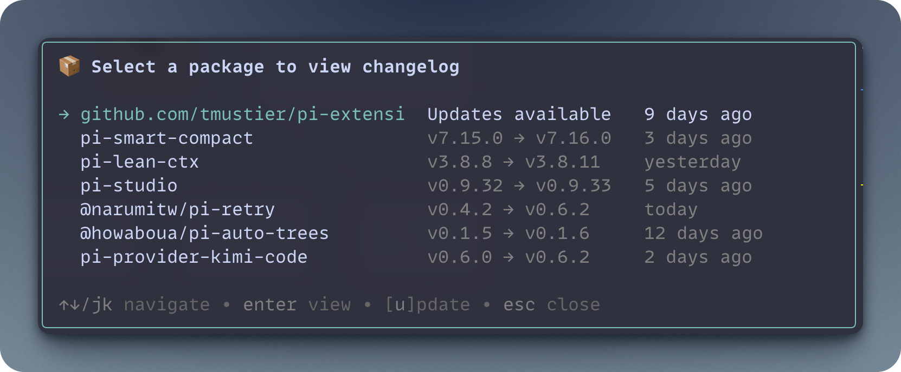
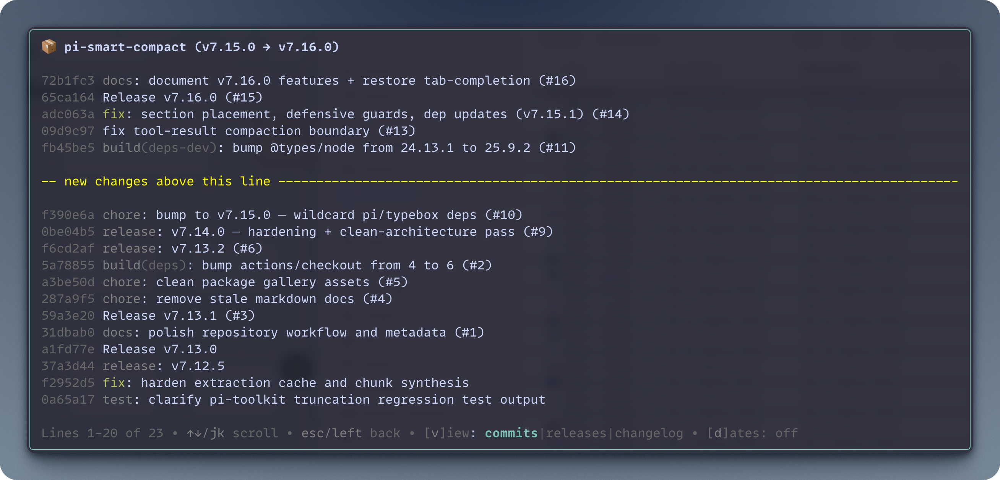

# update-changelog

Interactive changelog viewer and updater for installed Pi packages.

Detects available package updates asynchronously on startup, shows commit history, GitHub releases, and raw CHANGELOGs in a TUI overlay, and installs updates directly from the list.

## Demo





## Install

```bash
pi install git:github.com/mblarsen/pi-extensions
```

Filter to just this extension in `~/.pi/agent/settings.json`:

```json
{
  "packages": [
    {
      "source": "git:github.com/mblarsen/pi-extensions",
      "extensions": ["update-changelog/index.ts"]
    }
  ]
}
```

## Usage

| Command | Description |
|---|---|
| `/update-changelog` | Open the interactive package update changelog viewer |

## Detail views

- **commits** — chronological commit history with conventional-commit coloring (breaking changes in bold red, features in green, fixes in cyan)
- **releases** — markdown-rendered GitHub release notes with an inline `INSTALLED VERSION` marker
- **changelog** — lazily fetched raw `CHANGELOG.md` from the remote repository

## Interactive controls

- **↑↓** or **j/k** select package · **Enter** view details · **u** install update · **v** toggle view · **d** toggle dates (commits view) · **Esc** close
- In details view: **gg** top · **G** bottom · **Ctrl+U** half-page up · **Ctrl+D** half-page down

## LLM tool

`package_changelog` — fetch changelog and release notes for an npm package or GitHub repository. Shows version history and recent changes.

> [!TIP]
> Set `export PI_OFFLINE=1` to disable Pi's built-in startup package update check and let `/update-changelog` handle all update needs cleanly.
